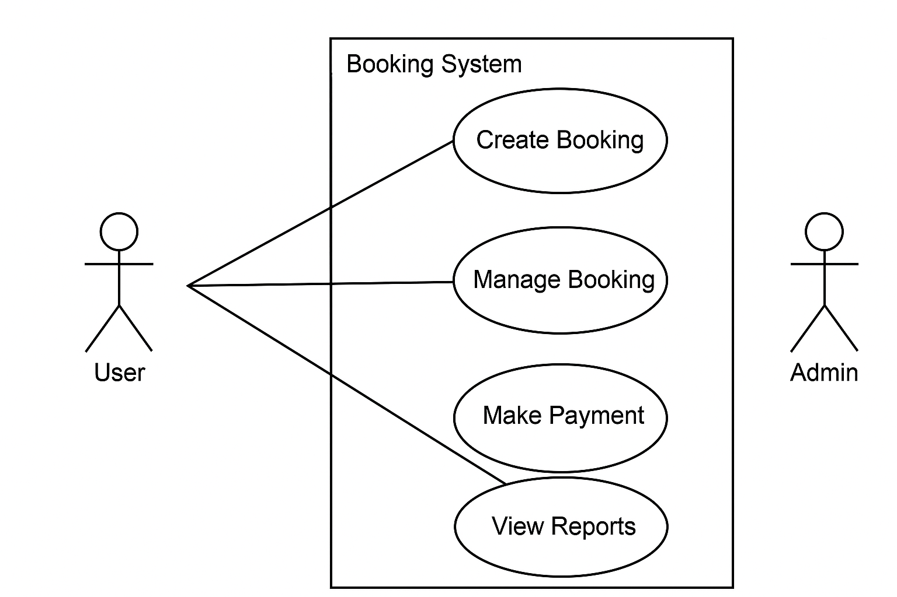

# requirement-analysis

## Introduction
Welcome to the **Requirement Analysis** repository! This repository is dedicated to documenting the process and importance of requirement analysis in the Software Development Life Cycle (SDLC). It's aimed at helping developers and stakeholders clearly understand the goals, constraints, and expectations of software projects.

---

## What is Requirement Analysis?
Requirement Analysis is the process of defining user expectations for a new or modified software application. It involves gathering, analyzing, documenting, and validating the needs and requirements of stakeholders to ensure the final product meets expectations.

It plays a critical role in bridging the gap between users and developers, ensuring that everyone is aligned on what the software must achieve.

---

## Why is Requirement Analysis Important?
- **Ensures Clear Understanding**: Prevents misunderstandings by making sure all stakeholders agree on the scope and functionality.
- **Reduces Project Risk**: Identifies potential issues early in the development lifecycle, saving time and cost.
- **Improves Product Quality**: By understanding the real needs of users, it ensures the final product delivers true value.

---

## Key Activities in Requirement Analysis
- **Requirement Gathering**: Collecting information from stakeholders, users, and market research.
- **Requirement Elicitation**: Involves interviews, surveys, brainstorming, and workshops to draw out requirements.
- **Requirement Documentation**: Recording the gathered requirements in an organized and readable format.
- **Requirement Analysis and Modeling**: Evaluating requirements for feasibility, conflicts, and clarity; modeling them using diagrams or structured language.
- **Requirement Validation**: Ensuring that documented requirements are complete, accurate, and aligned with user needs.

---

## Types of Requirements

### Functional Requirements
These define what the system should do.
**Examples for Booking Management System:**
- Users can create and manage bookings.
- The system allows payment processing for bookings.
- Admins can view all bookings and modify user access.

### Non-functional Requirements
These define how the system performs a task.
**Examples:**
- The system should be able to handle 1000 concurrent users.
- Payment processing should be completed within 2 seconds.
- System must comply with GDPR data privacy regulations.

---

## Use Case Diagrams
Use Case Diagrams visually represent system functionality and interactions between users (actors) and system actions (use cases).

**Benefits:**
- Helps in identifying system requirements from an end-user perspective.
- Offers a high-level overview of system functionality.

---

## Acceptance Criteria
Acceptance Criteria are predefined conditions that a product must meet to be accepted by a user, customer, or system.

**Importance:**
- Ensures everyone has a shared understanding of requirements.
- Helps in verifying that the software meets user expectations.

**Example: Checkout Feature**
- Users must be able to add bookings to cart.
- Users must be able to complete payment using mobile money or credit card.
- Upon successful payment, the system must send a confirmation email within 1 minute.

---

